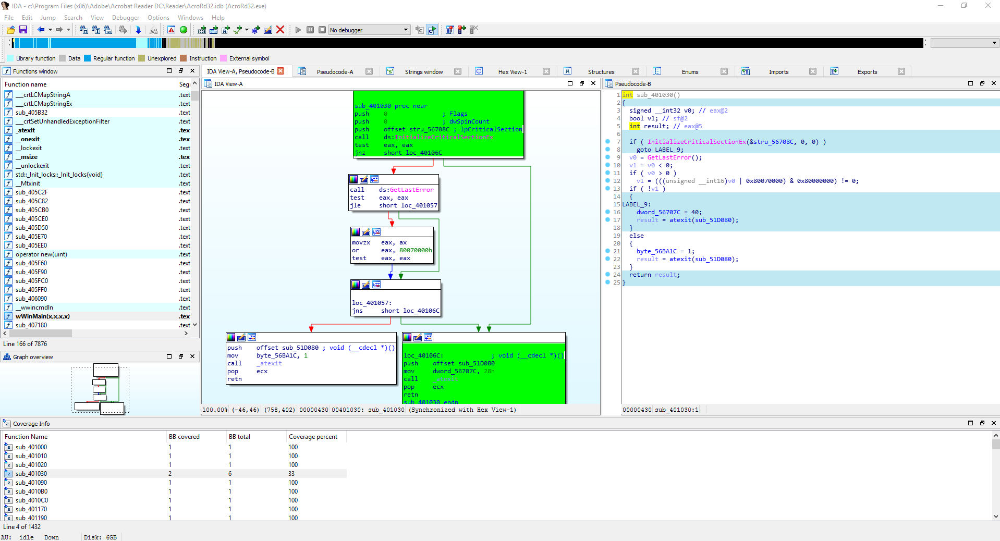

# VizCov

# Description
VizCov is a code coverage tool which let you to collect, accumulate and visualize coverage results with IDA Pro support. Especially useful for close source project with partial symbols but ofc you can use it also with completely stripped binaries.
## Tested on
Windows 10

But assumption wast that it should work on any platofrm. You just need to compile dr_vizcov.cpp client.

## Turn off system crash handling
For now, you need to do it manualy:

`Windows :`
```
HKEY_CURRENT_USER\Software\Microsoft\Windows\Windows Error Reporting\DontShowUI : 1
HKEY_CURRENT_USER\Software\Microsoft\Windows\Windows Error Reporting\Disabled : 1
```

`Linux : `
```
...
```

`OSX : `
```
...
```

# Components
**vizcov-collect.py**
```
usage: vizcov-collect.py [-h] [-i CORPUS_DIR] [-o OUT_DIR] [-f INPUT_FILE]
                         [-t TIME_OUT] [-c CONFIG_PATH]
                         argv [argv ...]

VizCov by Icewall

positional arguments:
  argv

optional arguments:
  -h, --help      show this help message and exit
  -i CORPUS_DIR   Path to corpus directory
  -o OUT_DIR      Path to store coverage data
  -f INPUT_FILE   File to be read instead of typical stdin arg
  -t TIME_OUT     Timeout in ms
  -c CONFIG_PATH  Path to config file
```                         
Collects coverage information.

**vizcov-summary.py**
```
vizcov-summary.py -h
usage: vizcov-summary.py [-h] -m MODULE_PATH -i INPUT_DIR -o OUT_DIR [-f]

VizCov by Icewall

optional arguments:
  -h, --help      show this help message and exit
  -m MODULE_PATH  Module path you want to summarize coverage
  -i INPUT_DIR    Coverage dir
  -o OUT_DIR      Output dir to store database
  -f              Activate storing coverage info of each file separetly.Then
                  you can use vizcov.get_files_for_address
```
Summarize collected coverage information's.

**client_src\dr_vizcov.cpp**
Dynamorio client collecting coverage information.

**vizcov-idaplugin.py**
IDA Pro plugin presenting coverage information results in IDA.

**IDA_create_db.py**
IDA Pro script use for storing information about basic blocks in sqlite db.

# Example session
## Dependencies
You need to have IDA Pro and Dynamorio. Thats all.
## config\config.py
Before you start, change all necessary paths pointing on Dynamorio dir, IDA Pro,etc.
## Collect separately coverage info for each of your corpus file 
```
vizcov-collect.py -i x:\corpus\pdf -o x:\Reader\coverage -t 5000 -c x:\vizcov\config.json -- "C:\Program Files (x86)\Adobe\Acrobat Reader DC\Reader\AcroRd32.exe" @@

VizCov client is running
[+] [BLACKLISTED] Module name : AcGenral.dll
[+] [BLACKLISTED] Module name : apphelp.dll
[+] [BLACKLISTED] Module name : iertutil.dll
[+] [BLACKLISTED] Module name : urlmon.dll
[+] [BLACKLISTED] Module name : dwmapi.dll
[+] [BLACKLISTED] Module name : MSACM32.dll
(...)
[+] Killer thread activated...its time to die
[+] Exiting
[+] Saving coverage informations to : x:\Reader\coverage/MgSWGcZi.json
(... next corpus file)
[+] Saving coverage informations to : x:\Reader\coverage/FuA8R.json
```
We can see collected coverage in `x:\Reader\coverage`:
```
dir /b x:\Reader\coverage

Dd40FkDx.json
MgSWGcZi.json
yT6dQBbY.json
ZjwjRzwk.json
```
Coverage informations are stored in that form:
`cat Dd40FkDx.json`
```
{
	"coverage": {
		"ACE.dll": {
			"bbls": [{
				"bb_rva": 4096,
				"bb_size": 10
			},
		(...)
		"AcroRd32.exe": {
			"bbls": [{
				"bb_rva": 4096,
				"bb_size": 10
			},
		(...)
	"corpus_file_path": "t:\\corpus\\pdf\\pdfa_schizo.pdf"
}
```
#### config.json
Example of config looks like this:
```
{
	"path_black_list": ["C:\\windows"],
	"path_white_list": [],
	"module_black_list" : [],
	"module_white_list":  [],
}
```
Using this config you can define which modules will be instrumented and which not. SPEED++. NO case-sensitive.

## Summarize collected coverage info for particular module into sqlite db
```
vizcov-summary.py -m "c:\Program Files (x86)\Adobe\Acrobat Reader DC\Reader\AcroRd32.exe" -i x:\Reader\coverage -o x:\Reader\summary -f
DEBUG:root:Summarizing collected coverage
DEBUG:root:Module has not been analyzed.
DEBUG:root:Launch IDA Pro
DEBUG:root:x:\IDA_6.9\idaq.exe -A -S"x:\vizcov\IDA_create_db.py x:\Reader\summary\AcroRd32.exe.sqlite3" "c:\Program Files (x86)\Adobe\Acrobat Reader DC\Reader\AcroRd32.exe"
DEBUG:root:Database created
DEBUG:root:Database is ready to load : x:\Reader\summary\AcroRd32.exe.sqlite3
```

We are now ready to open IDA with `AcroRd32.exe` and load `vizcov-idaplugin.py` script.
Plugin gonna ask you to point on sqlite db with summarized info `x:\Reader\summary\AcroRd32.exe.sqlite3`.
Next you can execute one of the methods:
```
===================
 VizCov by Icewall 
===================
Now you are ready to apply coverage
vizcov.coverage()                    # run after first run or when ur coverage db got updated
vizcov.show_table()                  # just to see applied results
vizcov.get_db()                      # to play with db in raw way
vizcov.get_files_for_address()       # if u summarize ur corpus with -f flag, u can use this function to get list of corpus files touching specified address
```

# Enjoy!
